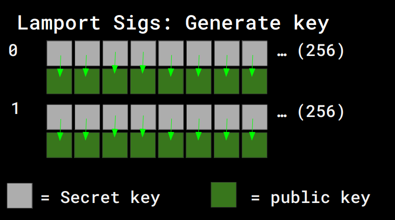
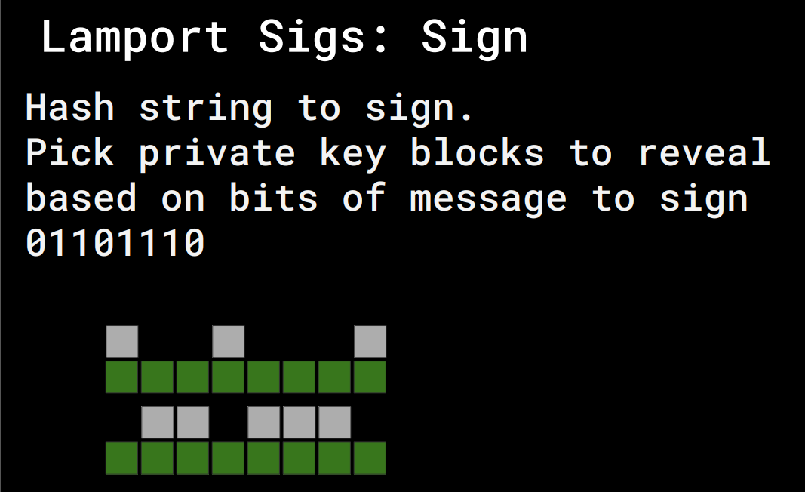
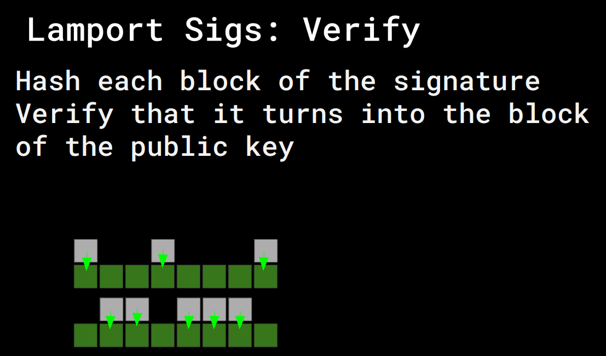

# Lamport signature

## Introduction
The project implement the Lamport Signature which is a Digital signature. Furthermore, its weakness is spotted out by forging a signature. 

## What is Lamport signature
Digital signature has played a very important roles in many system recently, especially in Blockchain. The Lamport signature is a hash-based digital signature which was invented by `Leslie Lamport` in 1979.

## How does Lamport signature work?

### Create secret and public keys
- Create SK:
  - Generate 256*2 blocks randomly (in 2 rows), each block is 32-bytes (just flipping coin)
- Create PK:
  - Get hashes for each block (in total 256*2 blocks)



### Signing message
- Sign message:
  - Hash the message with SHA256 -> To create fixed message (**256 bits**)
  - For each bit, the SK reveal the corresponding block
  - Example: 0100 will reveal $[b_0,a_1,b_2,b_3]$
  - Generally, the signature will has 256 blocks whose size is 32 bytes



### Verify signatures
- Verify:
  - In the same way, the receiver first hash the message
  - Then they hash each block of signature 
  - Finally, the compare the corresponding hashed block with the public key



> The receiver only know half of your SK, but... they cannot do anything else, except signing the same message. But... whoever do that since they can copy your signed message?

## Can it be forged?
The answer is **yes!**.
> Keep in mind that the more you sign, the more your SK revealed!

In this assignment, they have provided 4 messages with signatures. For each bit in the hashed messages, if you have both 0-bit and 1-bit, indeed, you have the private key of that block. 

The four provided data already have 225 bits which are statisfied the requirement above. It means that only 31 bits need to be constrained. this requires only $2^{31}$ different try, which is doable with the machine nowdays.

By this way, I added a random number follows after the message and increase it continously until they all reach the requirement.

## How to run the source?
There are two main implementations which are:
- The Lamport signature: `main.go`
- The source to forge signature: `forge.go`

For each implementation, there is a corresponding unit test. To run the test, you can type in your terminal
```Bash
$ go test src/*.go
``` 

However, because the forging process may require a lot of time to run, you can change the timeout to 30 minutes with the following command (by default is 10 minutes):
```Bash
$ go test src/*.go --timeout 30m
``` 

## Contribution
This implementation is owned by [phuc16102001](https://www.github.com/phuc16102001), and as the policy of MIT, please **do not look or copy it**.

## Reference
This is an assignment that I took from [Cryptocurrency engineering and design](https://ocw.mit.edu/courses/mas-s62-cryptocurrency-engineering-and-design-spring-2018) of the MIT open courseware.